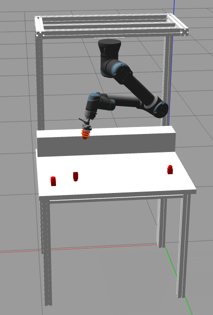

<p align='center'>
    <h1 align="center">Probabilistic and Logic Oriented Planning (PLOP)</h1>
</p>
<!-- <p align='center'>
    
</p> -->

----------

- [Project Description](#project-description)
- [Project Structure](#project-structure)
- [Requirements](#requirements)
  - [LLM KB Generation](#llm-kb-generation)
  - [PROLOG ONLY](#prolog-only)
- [Installation](#installation)
  - [LLM KB Generation](#llm-kb-generation-1)
  - [PROLOG ONLY](#prolog-only-1)
- [Running](#running)
  - [LLM KB Generation](#llm-kb-generation-2)
  - [PROLOG ONLY](#prolog-only-2)
- [Known issues and future works](#known-issues-and-future-works)
  - [Issues](#issues)
  - [Future works](#future-works)
- [Contributors](#contributors)


## Project Description
The goal of this project is to create a planner using Prolog
logic inference and the probabilistic reasoning offered by
Problog. 

## Project Structure


The main folder is:
- `prolog_project` it contains the ROS node (motion node and **planner** node)
    - scripts: Contains the two node plus the utilities
    - msg: Contains the `.msg` file for ROS communication

`block_world.pl` is the prolog file, the core of this project.

`python_node_poc.py` is a simple proof of concept for the pyswip wrapper for prolog

## Requirements

For installing the requirements I suggest to follow the
[Installation](#installation) section.

### LLM KB Generation
The requirements can be found inside the `requiremens.txt` file inside the `llm_kb_generation` folder. 


### PROLOG ONLY
For the prolog only version you will only need the [SWI Prolog](https://www.swi-prolog.org/build/PPA.html) interpeter.


## Installation

I reccomend to use Ubuntu 20.04 (I used it for developing the project)

### LLM KB Generation
Run `pip3` to install the requirements:

```bash
python3 -m pip install -U -r llm_kb_gen/requirements.txt
```

### PROLOG ONLY
1) For testing the *prolog only* version at first install the prolog interpreter [SWI Prolog](https://www.swi-prolog.org/build/PPA.html). Installation is the following:
    ```BASH
    sudo apt-add-repository ppa:swi-prolog/stable
    sudo apt update
    sudo apt install swi-prolog
    ```
2) Clone the project wherever you want
    ```BASH
    git clone https://github.com/davidedema/prolog_planner.git
    ```
3) Load the file with the swipl interpeter
    ```BASH
    cd ~/prolog_planner
    swipl block_world.pl
    ```

## Running

### LLM KB Generation
You can run the knowledge creation by calling the python script `gpt_convo.py`. It uses few-shots learning to teach the LLM how to respond. The examples are in the `few-shots.yaml` file, but other files can be added by using hte `-y/--yaml-files` arguments:

```bash
python3 llm_kb_gen/gtp_convo.py -y ./llm_kb_gen/few-shots1.yaml ./llm_kb_gen/few-shots2.yaml
```

If not YAML file is passed, the default one will be used.

Notice that the structure of the YAML file should be:
```YAML
few_shots:
  system_msg:
    role: 
    content: 
  convo:
    0:
      Q:
        role:
      A:
        content:
    1:
      Q:
        role:
      A:
        content:
```
The `system_msg` field should be defined only in one file though. 

### PROLOG ONLY
In order to create a pillar use the `pillar/7` rule. This needs 7 parameters in input:
- x: x coord for the pillar generation
- y: y coord for the pillar generation
- z: z coord for the pillar generation
- High: Pillar High
- Width: Pillar width
- Depth: Pillar depth
- Actions: Our "output" variable

It will return in the output variable the plan that the robot has to execute in order to perform the pillar creation

For example, let's create the pillar with height = 0.1 at (1, 0, 0)
```
pillar(1,0,0,0.1,0.05,0.05,A).
```
**PN:** In prolog every instruction finish with the dot '.'. 

After the instruction we will see an output like this:
```
?- pillar(1,0,0,0.1,0.05,0.05,A).
A = [rotate(b1, 0.27, -0.26, 0.685, 1), move(b1, 0.27, -0.26, 0.685, 1, 0, 0), move(b2, 0.41, -0.26, 0.685, 1, 0, -0.05), link(b2, b1)] .
```
We can see the freshly created pillar with the instruction `listing(block/13).`


## Known issues and future works

### Issues
- [x] The blocks do not stack in simulation (they jitter) -> **Solved**

### Future works
- Get the blocks info with machine learning methods (e.g. neuro problog)
- Optimize the makespan selecting the blocks that are faster to build 

## Contributors
- Enrico Saccon: enrico.saccon@unitn.it
- Ahmet Tikna: ahmet.tikna@unitn.it
- Syed Ali Usama: aliusama.syed@unitn.it
- Davide De Martini: davide.demartini@studenti.unitn.it
- Edoardo Lamon: edoardo.lamon@unitn.it
- Marco Roveri: marco.roveri@unitn.it
- Luigi Palopoli: luigi.palopoli@unitn.it


