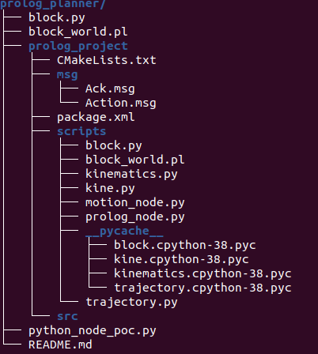

<p align='center'>
    <h1 align="center">Prolog planner for UR5 pick and place</h1>
    <p align="center">
    Project for my bachelor degree at the University of Trento A.Y.2022/2023
    </p>
    <p align='center'>
    Developed by:<br>
    De Martini Davide <br>
    </p>   
</p>

- [Project Description](#project-description)
- [Project Structure](#project-structure)
- [Requirements](#requirements)
  - [PROLOG ONLY](#prolog-only)
  - [PROLOG + ROS SIMULATION](#prolog--ros-simulation)
- [Installation](#installation)
  - [PROLOG ONLY](#prolog-only-1)
  - [PROLOG + ROS SIMULATION](#prolog--ros-simulation-1)
- [Running](#running)
  - [PROLOG ONLY](#prolog-only-2)
  - [PROLOG + ROS SIMULATION](#prolog--ros-simulation-2)
- [Known issues and future works](#known-issues-and-future-works)
  - [Issues](#issues)
  - [Future works](#future-works)
- [Thanks to](#thanks-to)


## Project Description
The goal of this project was to develop a Prolog Task planner for performing pick and place tasks. The main task is to build a tower with a "user defined" height. At first a prolog program `block_world.pl` was created. Then it was wrapped inside a ROS node for communicating to the robot. 

## Project Structure


The main folder is:
- `prolog_project` it contains the ROS node (motion node and **planner** node)
    - scripts: Contains the two node plus the utilities
    - msg: Contains the `.msg` file for ROS communication

`block_world.pl` is the prolog file, the core of this project.

`python_node_poc.py` is a simple proof of concept for the pyswip wrapper for prolog

## Requirements

For install the requirements I suggest to follow the [Installation](#installation) section.

### PROLOG ONLY
For the prolog only version you will only need the [SWI Prolog](https://www.swi-prolog.org/build/PPA.html) interpeter.

### PROLOG + ROS SIMULATION
For the ROS simulation you will need:
- [SWI Prolog](https://www.swi-prolog.org/build/PPA.html) interpeter
- [ROS noetic](http://wiki.ros.org/noetic)
- Python verion >= 3.8
- [Locosim framework](https://github.com/mfocchi/locosim) for simulating the UR5.
- [Pyswip](https://github.com/yuce/pyswip)


## Installation

I reccomend to use Ubuntu 20.04 (I used it for developing the project) 

### PROLOG ONLY
1) For testing the *prolog only* version at first install the prolog interpreter [SWI Prolog](https://www.swi-prolog.org/build/PPA.html). Installation is the following:
    ```BASH
    sudo apt-add-repository ppa:swi-prolog/stable
    sudo apt update
    sudo apt install swi-prolog
    ```
2) Clone the project wherever you want
    ```BASH
    git clone https://github.com/davidedema/prolog_planner.git
    ```
3) Load the file with the swipl interpeter
    ```BASH
    cd ~/prolog_planner
    swipl block_world.pl
    ```
### PROLOG + ROS SIMULATION
1) Follow the prolog installation (only step 1 and 2)
2) Install [**Pyswip**](https://github.com/yuce/pyswip)
    ```BASH
    pip3 install git+https://github.com/yuce/pyswip@master#egg=pyswip
    ```
3) Follow the [locosim](https://github.com/mfocchi/locosim) repository for installing ROS and the UR5 simulation
4) Clone this repository inside `~/ros_ws/src`
    ```
    git clone https://github.com/davidedema/prolog_planner
    ```
5) Build the project
    ```
    cd ~/ros_ws
    catkin_make install
    source install/setup.bash
    ```
## Running

### PROLOG ONLY
In order to create a pillar use the `pillar/7` rule. This needs 7 parameters in input:
- x: x coord for the pillar generation
- y: y coord for the pillar generation
- z: z coord for the pillar generation
- High: Pillar High
- Width: Pillar width
- Depth: Pillar depth
- Actions: Our "output" variable

It will return in the output variable the plan that the robot has to execute in order to perform the pillar creation

For example, let's create the pillar with height = 0.1 at (1, 0, 0)
```
pillar(1,0,0,0.1,0.05,0.05,A).
```
**PN:** In prolog every instruction finish with the dot '.'. 

After the instruction we will see an output like this:
```
?- pillar(1,0,0,0.1,0.05,0.05,A).
A = [rotate(b1, 0.27, -0.26, 0.685, 1), move(b1, 0.27, -0.26, 0.685, 1, 0, 0), move(b2, 0.41, -0.26, 0.685, 1, 0, -0.05), link(b2, b1)] .
```
We can see the freshly created pillar with the instruction `listing(block/13).`

### PROLOG + ROS SIMULATION
Before running the simulation we need to setup some parameters for the robot:
- **ENABLE GRIPPER**
    - Edit the file `/locosim/robot_control/lab_exercises/lab_palopoli/params.py` at line 44 and 45: set the two flags at **True**. Now the 2 finger gripper and grasping plugin is enabled.
- **SETUP THE WORLD**
    - Copy the `X1-Y1-Z2` folder (is the folder model) inside `/locosim/ros_impedance_controller/worlds/models/`
    - Overwrite the world file: `/locosim/ros_impedance_controller/worlds/tavolo.world` with the *tavolo.world* inside this repository
- After these two changes run:
    ```
    cd ~/ros_ws
    catkin_make install
    source install/setup.bash
    ```

Now you are able to run the simulation with the command:
```
python3 -i ~/ros_ws/src/locosim/robot_control/lab_exercises/lab_palopoli/ur5_generic.py
```
To enable the two nodes (motion and prolog planner) run these two commands in two separated terminal
```
python3 -i ~/ros_ws/src/prolog_project/prolog_project/scripts/motion_node.py
python3 -i ~/ros_ws/src/prolog_project/prolog_project/scripts/prolog_node.py
```


## Known issues and future works

### Issues
- [x] The blocks do not stack in simulation (they jitter) -> **Solved**

### Future works
- Get the blocks info with machine learning methods (e.g. neuro problog)
- Optimize the makespan selecting the blocks that are faster to build 

## Thanks to
- Luigi Palopoli (Thesis Supervisor): luigi.palopoli@unitn.it
- Marco Roveri (Supervisor): marco.roveri@unitn.it
- Edoardo Lamon (Supervisor): edoardo.lamon@unitn.it
- Enrico Saccon (Supervisor): enrico.saccon@unitn.it


